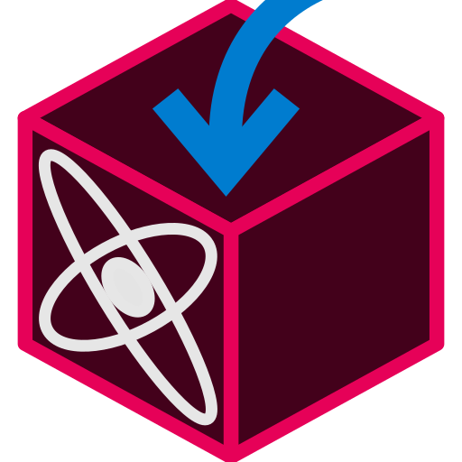
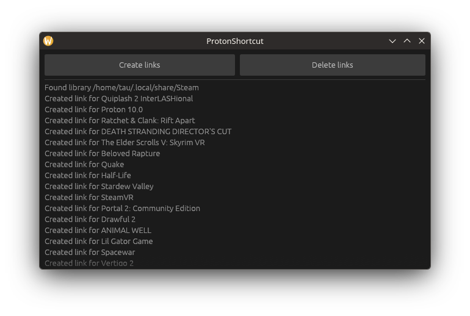

# ProtonShortcut

Generate shortcuts to access easily proton/prefix data for your games

---

### Installation

**Download and run the appimage [from the latest release here](https://github.com/Tau5/proton-shortcut/releases/latest)**

### Description

All games that use proton in Steam 
have a directory called a prefix where it stores all windows data and configuration

This directory is useful for retrieving save data, modding and all sort of things but
it is hard to access in the case of steam games because every steam prefix is named after it's appid
(you can find all the prefixes under `<Your steam library>/steamapps/compatdata`)

What this application does is make a symbolic link (kinda like a shortcut) in the installation directory of each game
(which you can access easily from steam itself) to this prefix so it is easier to access

You only have to run this app when you want to create new links or delete them. 
So you have to run it once to create links for all you installed apps and any time to create links for new ones

### Screenshots

